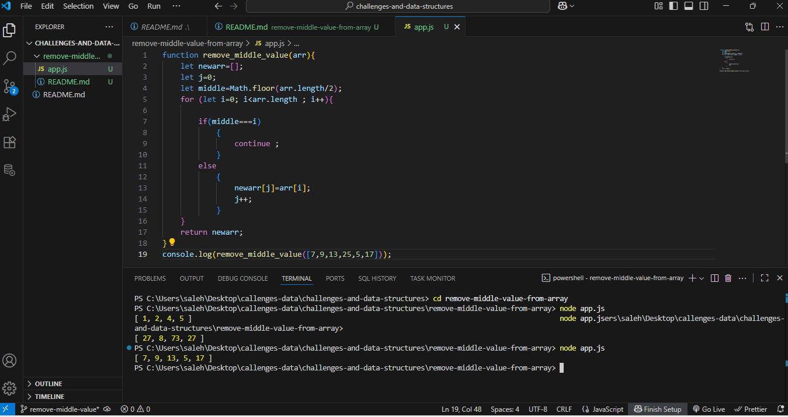

# challenges-and-data-structures
solution to coding challenges and data structures problems

# Chanllenge 4: Remove middle value from array
The goal of challenge is to remove the middle value from array while keeping the other element unchange
## whitboard solution 

