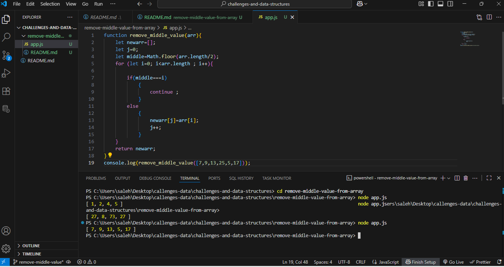

# Whitboard Challenge Images
## A visual documentaion of algorithmic whitboard challenges with annotated diagrams and concis explanation 

# remove middle value from array
## The goal of challenge is to remove the middle value from array while keeping the other element unchange
## whitboard solution 

